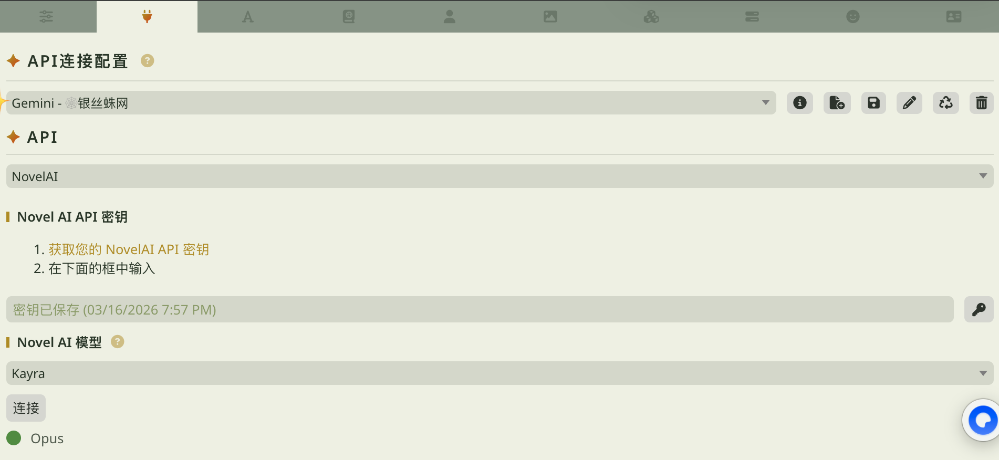
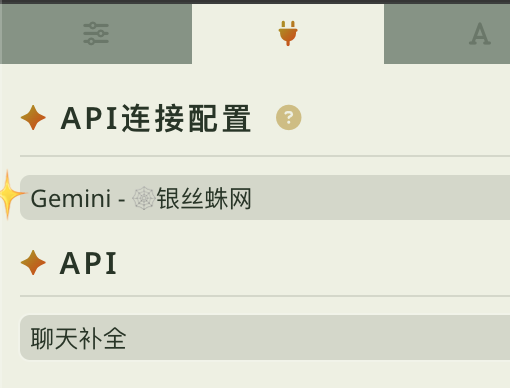
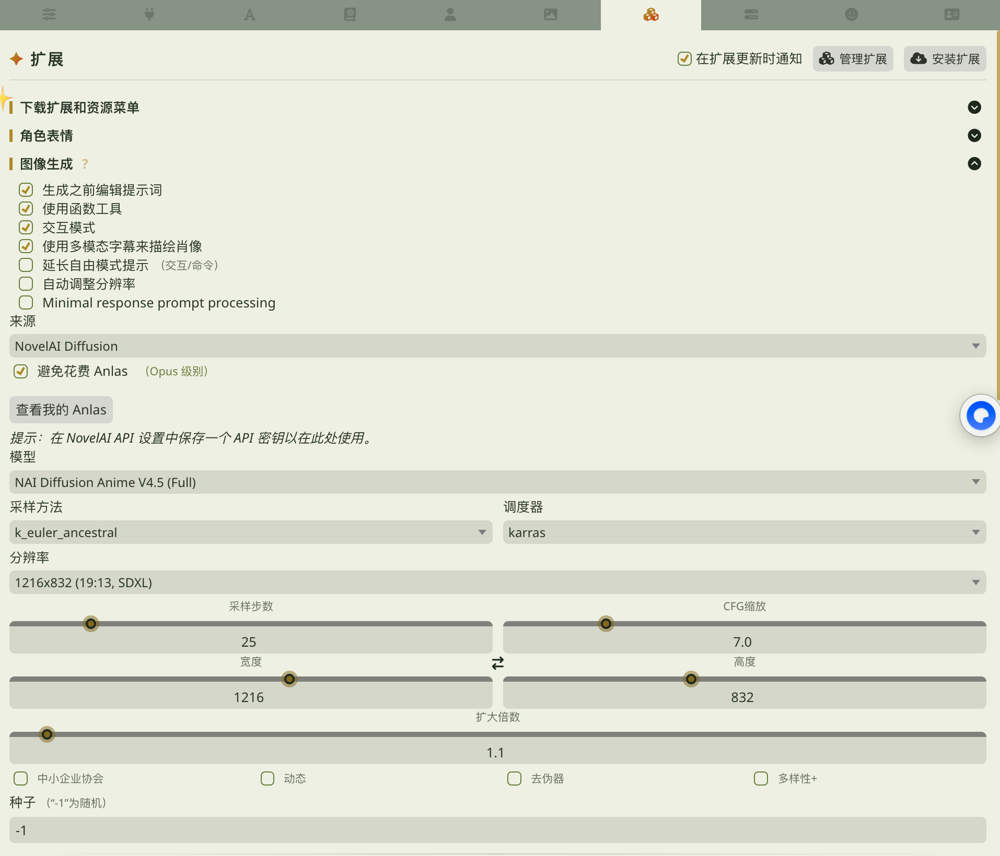
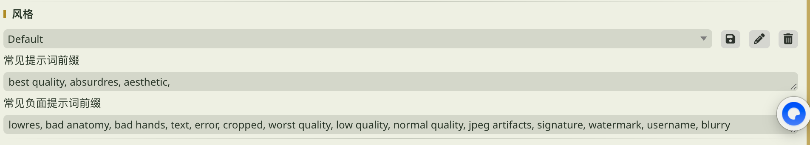

# 从零开始：SillyTavern + NovelAI 自动生图教程

本教程面向**完全没配过图片生成**的 SillyTavern 用户，从配置 NovelAI 到安装插件自动出图，全程手把手。

---

## 你需要准备什么

- **SillyTavern** 已安装并能正常运行
- **NovelAI 账号** 并拥有有效订阅（用于图片生成，推荐 Opus 级别）
- **Conso Illustrator 插件**（本教程会教你安装）

---

## 第一步：配置 NovelAI API 连接

首先需要让酒馆连上你的 NovelAI 账号。

1. 打开 SillyTavern，点击顶栏的 **插头图标**（API 连接配置）
2. 在 **API** 下拉菜单中选择 **NovelAI**
3. 在 **Novel AI API 密钥** 区域填入你的 API Key

> **如何获取 API Key：**
> 1. 登录 [NovelAI 官网](https://novelai.net)
> 2. 点击右上角头像 → **Account Settings**
> 3. 找到 **API Key / Access Token** 区域
> 4. 点击 **Get Persistent API Token** 或 **Generate** 复制密钥
> 5. 粘贴到酒馆的密钥输入框中
4. **Novel AI 模型** 选择 **Kayra**
5. 点击 **连接**，确认下方显示绿色状态（如 Opus）



6. **重要！配完后必须切回聊天补全！** NovelAI 的 API 配置只是为了让酒馆记住你的密钥。配好后回到 API 下拉菜单，**切回「聊天补全」**，否则主聊天会报错！



---

## 第二步：配置图片生成参数

API 连好后，需要配置图片生成的具体参数。

1. 点击顶栏的 **拼图图标**（扩展）
2. 展开 **图像生成** 区域
3. 将 **来源** 设置为 **NovelAI Diffusion**



### 新手推荐配置

以下是经过验证的新手友好配置，可以直接照抄：

**勾选项：**
- ✅ 生成之前编辑提示词
- ✅ 使用函数工具
- ✅ 交互模式
- ✅ 使用多模态字幕来描绘肖像
- ✅ 避免花费 Anlas（Opus 级别）

**参数设置：**

| 参数 | 推荐值 |
|------|--------|
| 模型 | NAI Diffusion Anime V4.5 (Full) |
| 采样方法 | k_euler_ancestral |
| 调度器 | karras |
| 分辨率 | 1216x832 (19:13, SDXL) |
| 采样步数 | 25 |
| CFG 缩放 | 7.0 |

> 这些参数适合绝大多数场景，后续可以根据需要自行调整。

### 风格配置

展开 **风格** 区域，设置常用的质量标签和负面标签：



**常见提示词前缀：**
```
best quality, absurdres, aesthetic,
```

**常见负面提示词前缀：**
```
lowres, bad anatomy, bad hands, text, error, cropped, worst quality, low quality, normal quality, jpeg artifacts, signature, watermark, username, blurry
```

> **关于画师串：** 如果你想让图片有特定画师的风格，可以在提示词前缀中加入画师串（artist tags）。画师串可以在社区中搜索获取，后面会介绍相关资源。

### 验证配置

在聊天框输入以下命令测试图片生成是否正常：

```
/sd 1girl, upper body, smile, school uniform
```

如果能成功生成一张图片，说明 NovelAI 配置正确！

> **如果 /sd 命令没反应或报错：** 请检查 API Key 是否正确填入、网络是否通畅、NovelAI 订阅是否有效。

---

## 第三步：安装 Conso Illustrator 插件

NovelAI 出图没问题后，接下来安装本插件。

### 方法一：从酒馆界面安装（推荐）

1. 点击顶栏 **拼图图标** → **安装扩展**
2. 在输入框中粘贴仓库地址：
   ```
   https://github.com/Asobi-123/sillytavern-conso-illustrator
   ```
3. 点击安装，等待完成
4. 刷新页面

### 方法二：手动安装

```bash
cd SillyTavern/data/default-user/extensions/
git clone https://github.com/Asobi-123/sillytavern-conso-illustrator.git
```

安装后刷新页面。

---

## 第四步：启用插件并生成第一张图

1. 点击 **拼图图标** → 向下滚动找到 **Auto Illustrator** 区域并展开
2. 勾选 **启用自动插画**
3. 在 **元提示与显示** 中，选择元提示预设：
   - 推荐选择 **NAI 4.5 Full**（专为 NovelAI 优化的提示词生成规则）
4. 打开一个角色卡聊天，随便发一条消息
5. 观察发生了什么：
   - 流式预览控件显示 AI 回复
   - AI 回复中包含图片生成提示词
   - 提示词自动发送给 NovelAI
   - 图片出现在聊天消息中！
   - 如果你启用了悬浮面板，右侧还会出现一个小图标，点击即可打开主控台

> **第一次可能需要几秒钟**，取决于 NovelAI 的响应速度和你的网络状况。

### 可选：打开悬浮面板

从 `1.6.0` 开始，插件新增了一个悬浮工作台，用来集中放高频操作。

你会看到一个右侧小图标，点击后可进入：

- **主控台**：开关自动插画、切换模式、修改当前聊天图片文件夹标签、切换主题
- **提示词设置**：共享 API / 独立 API 模式下的主要配置
- **画廊**：查看当前聊天的图片
- **独立生图**：不发聊天消息，直接测试 prompt 和出图

如果你不想看到这个小图标：

1. 回到旧设置页
2. 关闭 **显示悬浮面板图标**
3. 以后仍然可以通过设置页里的 **打开悬浮面板** 按钮重新打开

---

## 第五步：理解两种模式

插件有两种提示词生成模式，分别适合不同场景：

### 共享 API 模式（默认）

- **原理：** 把"帮我生成图片提示词"的指令嵌入到主聊天中，LLM 在正常回复的同时生成提示词
- **优点：** 零额外配置，不增加 API 调用次数
- **缺点：**
  - 生图指令会占用主 API 的注意力和 token，可能影响 AI 回复质量
  - AI 的回复中偶尔会残留一些提示词标签
- **适合：** 刚上手的新用户，想最快跑起来

### 独立 API 模式

- **原理：** AI 先正常回复，然后插件单独发一次 API 调用来生成提示词
- **优点：**
  - 主 API 完全不受影响——不会被生图指令分散注意力，也省下了提示词占用的 token
  - AI 回复干净，不会出现提示词残留
  - 提示词质量通常更高（因为用专门的请求来做这件事）
- **缺点：** 需要配置额外的 LLM API 地址和密钥，每条消息多一次 API 调用
- **适合：** 不想让生图干扰主 API 回复质量的用户

### 怎么选？

```
刚开始用，想最快跑起来？         → 共享 API 模式（默认，零配置）
不想生图占用主 API 的注意力？    → 独立 API 模式
AI 回复里出现奇怪的标签？        → 切到独立 API 模式
想要最好的提示词质量？           → 独立 API 模式
```

> 切换方式：在插件设置中找到 **提示词生成模式**，切换即可。独立 API 模式需要额外配置 LLM API 地址和密钥（在 **独立 LLM API** 区域配置）。

### 预设的对应关系（重要！）

两种模式各自有自己的预设系统，**不要搞混**：

| | 共享 API 模式 | 独立 API 模式 |
|---|---|---|
| **用哪个预设？** | **元提示预设**（Meta Prompt Preset） | **指南预设**（Guidelines Preset） |
| **在哪配？** | 元提示与显示 → 元提示预设 | 独立 API 模式 → 指南预设 |
| **控制什么？** | 嵌入主聊天的生图指令格式 | 独立 API 调用的频率指南和编写指南 |
| **内置选项** | Default、NAI 4.5 Full | Default |

两种预设都支持自定义——你可以修改后另存为新预设，随时切换。

> **新手常见误区：** 用了独立 API 模式，却去改元提示预设——其实那是共享模式才用的。独立 API 模式下应该配 **指南预设**。反过来也一样，用共享模式就不用管指南预设。

---

## 第六步：让图片更好看

基础配好之后，可以通过以下功能提升图片质量：

### 通用样式 Tag

在插件设置的 **提示词检测与风格** 中，可以设置：
- **前缀标签**：添加在每个提示词开头，如画师串、质量标签
- **后缀标签**：添加在每个提示词结尾

> 这里的样式 Tag 是插件级别的，和酒馆 Image Generation 里的风格不同。两者都会生效。

### 角色固定 Tag（非必须，可选，觉得API生成得不好再放入，）

为每个角色锁定固定的外貌标签，这样不管 LLM 怎么生成提示词，角色的外貌都是一致的。

例如：给角色「陆知薇」设置固定 Tag：
```
lu zhiwei, girl, orange long hair, blue eyes, school uniform
```

设置方法：在插件设置中找到 **角色固定 Tag** 区域，添加角色和对应标签。

> **多人场景自动隔离：** 如果正文场景中有多个角色，插件会自动用 `{}` 包裹每个角色的标签，防止 AI 把不同角色的特征搞混。（对单人图较不友好，因为匹配使用的是正文会出现多个角色）

### 世界书注入

如果你的角色有配套世界书（描述世界观、场景、道具等），可以把世界书信息注入给提示词生成 LLM，让图片更贴合设定。

绝赞点：完全和酒馆的世界书开关独立，所有条目默认关闭，需要自行打开。也就是说你和角色A聊天，默认配置角色A世界书，但是你想增加角色B的世界书？没问题！开几个服装世界书？没问题！ 场景世界书？更没问题！ 和独立生图工作台搭配起来更好吃了。

设置方法：在 **独立 API 模式** 下的 **世界书注入** 中选择需要的世界书和条目。

---

## 第七步：独立生图工作台（进阶）

不想发聊天消息也能出图！独立生图工作台让你直接测试出图效果。

在插件设置中找到 **独立生图** 区域：

### AI 生成模式
1. 输入场景描述（比如"一个女孩在夕阳下的教室里看书"）
2. 点击 **生成提示词**，LLM 会生成多条提示词建议
3. 可以编辑每条提示词
4. 逐条生图 或 点击 **一键全自动** 批量生成

### 手动输入模式
1. 直接粘贴你的 NovelAI prompt
2. 点击生图

> 独立生图的图片会存到独立文件夹，不会和聊天图片混在一起。

### 关于世界书和角色信息注入

独立生图工作台有自己的 checkbox 控制是否注入世界书和角色信息。但**世界书的具体配置**（选哪些世界书、启用哪些条目）需要在独立 API 模式的 drawer 里设置。

如果你用的是共享 API 模式，操作步骤是：
1. 先切到 **独立 API 模式**
2. 在里面配好 **世界书注入**（选择世界书和条目）和 **角色信息注入**
3. 切回 **共享 API 模式**
4. 独立生图工作台中勾选对应的注入选项即可生效

---

## 实用资源

| 资源 | 链接 | 用途 |
|------|------|------|
| NovelAI Inspect | https://novelai.net/inspect | 上传 NAI 生成的图片，提取元数据中的提示词和画师串 |
| Danbooru (Safe) | https://safebooru.donmai.us | 检索画师串、角色标签、场景标签 |
| NAI 入门法典 | https://nai-bot.pages.dev/法典/法典目录/ | NovelAI 简单入门教程和画师串大全 |

---

## 常见问题速查

### 图片没有生成？
- 先在聊天框输入 `/sd 1girl` 测试酒馆原生图片生成是否正常
- 检查 API 连接配置中 NovelAI 是否已连接
- 检查扩展 → 图像生成 → 来源是否选了 NovelAI Diffusion

### 图片质量差？
- 检查风格配置中的提示词前缀和负面前缀是否填好
- 尝试添加画师串到前缀中
- 分辨率不要太小（推荐 1216x832 或更大）

### AI 回复里出现奇怪的标签？
- 这是共享 API 模式的正常现象
- 切换到独立 API 模式可以解决

### 提示词和场景不匹配？
- 试试切换元提示预设，推荐 **NAI 4.5 Full**
- 使用角色固定 Tag 锁定角色外貌
- 使用独立 API 模式，提示词质量通常更高

更多问题请查看 [故障排查指南](TROUBLESHOOTING.md)。

---

*本教程适用于 Conso Illustrator v1.6.0+*
