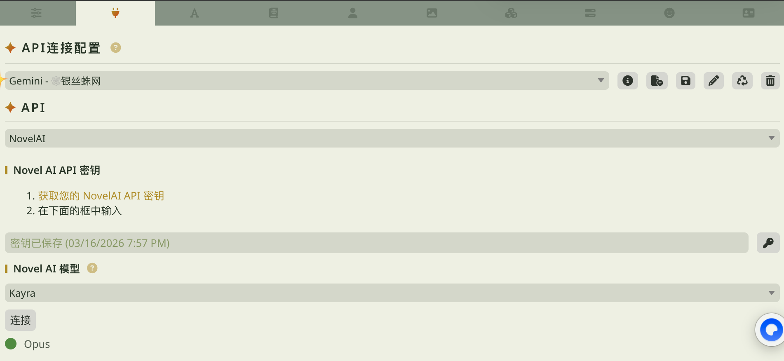
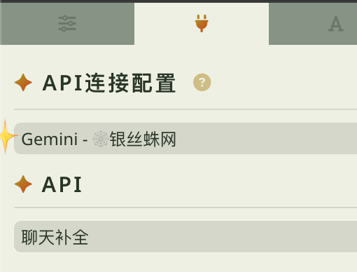
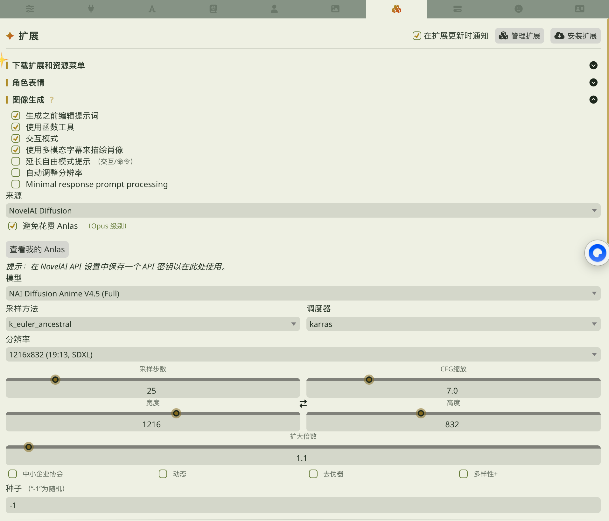
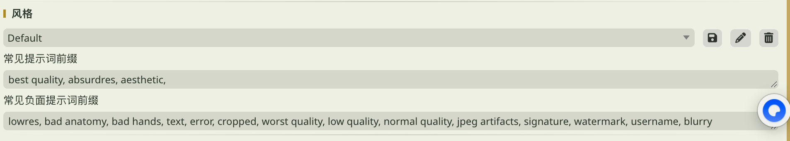

# 从零开始：SillyTavern + NovelAI 自动生图教程

本教程面向**完全没配过图片生成**的 SillyTavern 用户，从配置 NovelAI 到安装插件自动出图，全程手把手。

---

## 你需要准备什么

- **SillyTavern** 已安装并能正常运行
- **NovelAI 账号** 并拥有有效订阅（用于图片生成，推荐 Opus 级别）
- **Conso Illustrator 插件**（本教程会教你安装）

---

## 第一步：配置 NovelAI API 连接

首先需要让酒馆连上你的 NovelAI 账号。

1. 打开 SillyTavern，点击顶栏的 **插头图标**（API 连接配置）
2. 在 **API** 下拉菜单中选择 **NovelAI**
3. 在 **Novel AI API 密钥** 区域填入你的 API Key

> **如何获取 API Key：**
> 1. 登录 [NovelAI 官网](https://novelai.net)
> 2. 点击右上角头像 → **Account Settings**
> 3. 找到 **API Key / Access Token** 区域
> 4. 点击 **Get Persistent API Token** 或 **Generate** 复制密钥
> 5. 粘贴到酒馆的密钥输入框中
4. **Novel AI 模型** 选择 **Kayra**
5. 点击 **连接**，确认下方显示绿色状态（如 Opus）



6. **重要！配完后必须切回聊天补全！** NovelAI 的 API 配置只是为了让酒馆记住你的密钥。配好后回到 API 下拉菜单，**切回「聊天补全」**，否则主聊天会报错！



---

## 第二步：配置图片生成参数

API 连好后，需要配置图片生成的具体参数。

1. 点击顶栏的 **拼图图标**（扩展）
2. 展开 **图像生成** 区域
3. 将 **来源** 设置为 **NovelAI Diffusion**



### 新手推荐配置

以下是经过验证的新手友好配置，可以直接照抄：

**勾选项：**
- ✅ 生成之前编辑提示词
- ✅ 使用函数工具
- ✅ 交互模式
- ✅ 使用多模态字幕来描绘肖像
- ✅ 避免花费 Anlas（Opus 级别）

**参数设置：**

| 参数 | 推荐值 |
|------|--------|
| 模型 | NAI Diffusion Anime V4.5 (Full) |
| 采样方法 | k_euler_ancestral |
| 调度器 | karras |
| 分辨率 | 1216x832 (19:13, SDXL) |
| 采样步数 | 25 |
| CFG 缩放 | 7.0 |

> 这些参数适合绝大多数场景，后续可以根据需要自行调整。

### 风格配置

展开 **风格** 区域，设置常用的质量标签和负面标签：



**常见提示词前缀：**
```
best quality, absurdres, aesthetic,
```

**常见负面提示词前缀：**
```
lowres, bad anatomy, bad hands, text, error, cropped, worst quality, low quality, normal quality, jpeg artifacts, signature, watermark, username, blurry
```

> **关于画师串：** 如果你想让图片有特定画师的风格，可以在提示词前缀中加入画师串（artist tags）。画师串可以在社区中搜索获取，后面会介绍相关资源。

### 验证配置

在聊天框输入以下命令测试图片生成是否正常：

```
/sd 1girl, upper body, smile, school uniform
```

如果能成功生成一张图片，说明 NovelAI 配置正确！

> **如果 /sd 命令没反应或报错：** 请检查 API Key 是否正确填入、网络是否通畅、NovelAI 订阅是否有效。

---

## 第三步：安装 Conso Illustrator 插件

NovelAI 出图没问题后，接下来安装本插件。

### 方法一：从酒馆界面安装（推荐）

1. 点击顶栏 **拼图图标** → **安装扩展**
2. 在输入框中粘贴仓库地址：
   ```
   https://github.com/Asobi-123/sillytavern-conso-illustrator
   ```
3. 点击安装，等待完成
4. 刷新页面

### 方法二：手动安装

```bash
cd SillyTavern/data/default-user/extensions/
git clone https://github.com/Asobi-123/sillytavern-conso-illustrator.git
```

安装后刷新页面。

---

## 第四步：启用插件并生成第一张图

1. 点击 **拼图图标** → 向下滚动找到 **Auto Illustrator** 区域并展开
2. 勾选 **启用自动插画**
3. 在 **元提示与显示** 中，选择元提示预设：
   - 推荐选择 **NAI 4.5 Full**（专为 NovelAI 优化的提示词生成规则）
4. 打开一个角色卡聊天，随便发一条消息
5. 观察发生了什么：
   - 如果开启了流式预览组件，会显示 AI 回复过程
   - AI 回复中包含图片生成提示词
   - 提示词自动发送给 NovelAI
   - 图片出现在聊天消息中！
   - 如果你启用了悬浮面板，右侧还会出现一个小图标，点击即可打开主控台

> **第一次可能需要几秒钟**，取决于 NovelAI 的响应速度和你的网络状况。

### 可选：打开悬浮面板

从 `1.6.0` 开始，插件新增了一个悬浮工作台，用来集中放高频操作。

你会看到一个右侧小图标，点击后可进入：

- **主控台**：开关自动插画、切换模式、修改当前聊天图片文件夹标签、切换主题
- **主控台正则**：同步内置酒馆 Regex，过滤不该发给模型的插画标签
- **提示词设置**：共享 API / 独立 API 模式下的主要配置
- **画廊**：查看当前聊天的图片
- **独立生图**：不发聊天消息，直接测试 prompt 和出图
- **提示词仓库**：导入 NovelAI PNG，提取、保存、复制提示词

如果你不想看到这个小图标：

1. 回到旧设置页
2. 关闭 **显示悬浮面板图标**
3. 以后仍然可以通过设置页里的 **打开悬浮面板** 按钮重新打开

---

## 第五步：理解两种模式

插件有两种提示词生成模式，分别适合不同场景：

### 共享 API 模式（默认）

- **原理：** 把"帮我生成图片提示词"的指令嵌入到主聊天中，LLM 在正常回复的同时生成提示词
- **优点：** 零额外配置，不增加 API 调用次数
- **缺点：**
  - 生图指令会占用主 API 的注意力和 token，可能影响 AI 回复质量
  - AI 的回复中偶尔会残留一些提示词标签
- **适合：** 刚上手的新用户，想最快跑起来

### 独立 API 模式

- **原理：** AI 先正常回复，然后插件单独发一次 API 调用来生成提示词
- **优点：**
  - 主 API 完全不受影响——不会被生图指令分散注意力，也省下了提示词占用的 token
  - AI 回复干净，不会出现提示词残留
  - 提示词质量通常更高（因为用专门的请求来做这件事）
- **缺点：** 需要配置额外的 LLM API 地址和密钥，每条消息多一次 API 调用
- **适合：** 不想让生图干扰主 API 回复质量的用户

### 怎么选？

```
刚开始用，想最快跑起来？         → 共享 API 模式（默认，零配置）
不想生图占用主 API 的注意力？    → 独立 API 模式
AI 回复里出现奇怪的标签？        → 切到独立 API 模式
想要最好的提示词质量？           → 独立 API 模式
```

> 切换方式：在插件设置中找到 **提示词生成模式**，切换即可。独立 API 模式需要额外配置 LLM API 地址和密钥（在 **独立 LLM API** 区域配置）。

### 预设的对应关系（重要！）

两种模式各自有自己的预设系统，**不要搞混**：

| | 共享 API 模式 | 独立 API 模式 |
|---|---|---|
| **用哪个预设？** | **元提示预设**（Meta Prompt Preset） | **指南预设**（Guidelines Preset） |
| **在哪配？** | 元提示与显示 → 元提示预设 | 独立 API 模式 → 指南预设 |
| **控制什么？** | 嵌入主聊天的生图指令格式 | 独立 API 调用的频率指南和编写指南 |
| **内置选项** | Default、NAI 4.5 Full | Default |

两种预设都支持自定义——你可以修改后另存为新预设，随时切换。

> **新手常见误区：** 用了独立 API 模式，却去改元提示预设——其实那是共享模式才用的。独立 API 模式下应该配 **指南预设**。反过来也一样，用共享模式就不用管指南预设。

---

## 第六步：让图片更好看

基础配好之后，可以通过以下功能提升图片质量：

### 通用样式 Tag

在插件设置的 **提示词检测与风格** 中，可以设置：
- **前缀标签**：添加在每个提示词开头，如画师串、质量标签
- **后缀标签**：添加在每个提示词结尾

> 这里的样式 Tag 是插件级别的，和酒馆 Image Generation 里的风格不同。两者都会生效。

### 生图 SD Style 和 Vibe 组合（可选，进阶）

如果你在酒馆 **Image Generation** 扩展里保存了多套 Style，或在 **Vibe 管理** 里保存了多套 Vibe 组合，可以让 conso 在每次生图前自动决定这次使用哪一套。

在插件 **主控台 → 生图 SD Style 和 Vibe 组合** 卡片里可以选择：

- **关闭**：不介入，沿用酒馆当前 SD Style 和 Vibe 管理里的当前选择
- **固定**：每次生图前套用指定 SD Style / Vibe 组合
- **随机**：每次生图前从参与抽签的 SD Style / Vibe 组合里随机抽取

随机模式下：

- **SD Style 白名单**：列表里勾选的 Style 才会参与抽签；全不勾 = 使用全部
- **Vibe 组合白名单**：列表里勾选的 Vibe 组合才会参与抽签；全不勾 = 使用全部
- **生成完成后还原原前缀**：默认开。生图过程中即使被覆盖，结束后会把酒馆里 Common prompt prefix / Negative common prompt prefix 还原成你打开开关前的样子；如果你在生图期间**手动**改了那两个文本框，conso 不会盖掉你的修改
- **关闭开关 = 完全不介入**：行为和升级前一致，等同你手动选哪个 Style 就一直用哪个
- **固定搭配**：可以保存“某个 SD Style + 某个 Vibe 组合”的命名搭配，之后一键固定使用

生成后，独立生图结果、图片画廊和图片查看器会显示这张图实际使用的 SD Style / Vibe 组合，方便回看。

> ⚠ 启用随机或固定 SD Style 时，多张图的生图过程会被强制串行（一张接一张），避免并发互相踩酒馆全局 SD Style 值。如果你只想长期用同一套 Style，关掉插件控制 + 在酒馆 SD 扩展里手动选定那一套会更高效。

### NovelAI 高级后端功能（可选，进阶）

部分 NovelAI 高级功能需要安装后端插件：Vibe Transfer、局部重绘。只安装前端扩展时，普通 `/sd` 生图可以运行，但这些功能不可用。

安装后端插件：

1. 复制本仓库的 `server-plugin/auto-illustrator-nai-advanced` 文件夹
2. 粘贴到 `<SillyTavern 根目录>/plugins/auto-illustrator-nai-advanced`
3. 如果目标位置已经有同名旧文件夹，用新版覆盖旧版。以后只有面板提示后端插件版本过旧，或更新说明明确提到后端插件有变更时，才需要手动覆盖这里的后端插件文件夹
4. 确认 SillyTavern 已配置 NovelAI API token
5. 在 `<SillyTavern 根目录>/config.yaml` 中设置 `enableServerPlugins: true`
6. 重启 SillyTavern。只刷新页面不会加载新的 server plugin
7. 刷新页面后，再使用 Vibe Transfer 或局部重绘

面板信息卡片里也有 **后端安装提示** 按钮，会显示同一套安装说明。

#### Vibe Transfer 使用说明

Vibe Transfer 可以让 NovelAI 在原有提示词之外参考某种画风、构图或角色信息。Conso 支持两类 Vibe：

- **参考图 Vibe**：上传图片后，首次使用时由 NovelAI 生成 Vibe 编码。
- **编码 Vibe**：从单条 `.naiv4vibe.json` 或合集 `.naiv4vibebundle.json` 导入，只有编码也能用于生图，不需要源图。
- **带图 Vibe cache**：支持 `type: image` 的 `.naiv4vibe`，会同时导入源图、缩略图和编码缓存。源图写入后端 Vibe 源图目录，之后可以按新模型或新信息量重新编码。
- **Vibe 分组 JSON**：支持包含 `groups`、`vibeData`、`vibePresets`、`presetImages` 的分组文件，导入时保留内部组名和组内强度。

安装后端插件后，打开 conso 悬浮面板，在 **Vibe Transfer** 卡片里启用功能。主控台只保留开关、状态和 **打开 Vibe 管理** 入口；上传、搜索、参数调整、导入导出、组合保存都在 **Vibe 管理** tab 里。

使用时需要注意：

- 正面提示词、负面提示词、通用样式 Tag、角色固定 Tag、SD Style 仍然生效。Vibe Transfer 只是额外加入参考约束。
- V4/V4.5 第一次启用某张源图并生成时，可能会调用 `encode-vibe` 并消耗 Anlas；后续同一张图、同一模型、同一信息提取量会复用缓存。
- 修改模型、信息提取量或替换参考图后，可能会重新生成缓存。
- 上传的参考图会保存为压缩后的 Vibe 源图，最长边 768px，并转为 JPEG；原始大 PNG 不会保存进插件设置。
- Vibe 库可以保存超过 16 个项目；16 是单次生成的启用上限，不是库容量。手动勾选第 17 个时会阻止启用并显示提示。
- 导入单条 Vibe 会按文件名创建独立风格组。导入超过 16 条的 bundle 会自动拆成每组最多 16 条，并只启用第一组。
- 重复导入同名文件会创建带编号的新分组，不会覆盖旧分组。普通风格组可以重命名；空名称、过长名称和重复名称不会保存。
- 导入 Vibe 文件时不会覆盖已有 Vibe。若外部 ID 冲突，Conso 会创建新的本地 ID，并保留原外部 ID 用于导出。
- **导出所选 Vibe JSON** 使用当前勾选项：勾选一个时导出标准单条文件；勾选多个时由同一个按钮导出包含 `groups`、`vibeData`、`vibePresets`、`presetImages` 的 `vibe-group-<分组名>-<时间戳>.json`。当前勾选项与已保存风格组一致时沿用该组名称，否则使用“所选 Vibe”。
- 导出默认只写入编码缓存，带源图的项目也会导出为 `type: encoding`。勾选导出区的 **包含源图** 后，能读取到源图的项目才会导出为 `type: image`，并携带源图和可用缩略图；没有源图的项目仍保持 `type: encoding`。本地搜索标签不会写入。只有源图但还没有编码的项目会被跳过。
- 导出时会保证 bundle 内每条 Vibe 的 ID 唯一，导出的文件可以重新导入。
- `.naiv4vibe`、`.naiv4vibe.json`、`.naiv4vibebundle.json` 和已识别的 Vibe 分组 JSON 兼容当前观察到的 NovelAI Vibe 格式；其他工具扩展的未知私有字段不会写入 Conso 导出文件。

Vibe 管理里每张卡片都有自己的强度和信息量：

- **显示模式**：只查看当前参数、当前模型缓存状态和缓存数量。
- **编辑模式**：可以调整单张卡片的强度和信息量。有源图的 Vibe 会按信息量查找或生成缓存；只有编码、没有源图的导入 Vibe 会显示导入信息量，但不会假装重新编码。
- **待编码**组：这是风格组选择里的固定入口，不是保存出来的组合。它显示有源图、但当前模型和当前信息量还没有缓存的 Vibe。上传新的源图后会自动切到这个组，且不会自动启用。

Vibe 组合用于保存“启用了哪些 Vibe 和它们的参数”。默认按钮是 **另存为**，不会覆盖现有组合；需要覆盖时使用单独的 **覆盖组合** 按钮，并确认目标组合名称。已保存组合可以用 **重命名组合** 修改名称，组合 ID 和固定/随机生图引用不会改变。

#### 局部重绘使用说明

局部重绘用于修改已有图片的一小块或一片区域。它从已有图片的操作入口进入，不会影响普通自动生图队列。

使用流程：

1. 在已有图片的操作入口中选择 **NovelAI 局部重绘**
2. 用画笔绘制要改的区域，必要时用画布缩放放大细节
3. 写清楚遮罩区域要变成什么，也可以补充负面提示词
4. 按需要调整强度、遮罩外扩、边缘羽化、边界保护和保留原图色调
5. 生成后先在编辑器内看预览
6. 满意后再插入结果；可以追加到原图后，也可以显式选择替换原图

参数没有绝对正确值，以最终预览结果为准。建议每次只小幅调整一两个参数，再比较结果。

常用判断：

- **改颜色但保留结构**：强度不要太高，保留原图色调可按结果开关比较
- **边缘痕迹明显**：先小幅调整边缘羽化和边界保护
- **模型没理解修改区域**：适当增加遮罩外扩，让 NovelAI 看到更多周围上下文
- **靠近头发或皮肤**：可以画得稍微宽一点，再用边界保护减少贴回范围

### 角色固定 Tag（可选）

为每个角色锁定固定的外貌标签，这样不管 LLM 怎么生成提示词，角色的外貌都是一致的。

例如：给角色「陆知薇」设置固定 Tag：
```
lu zhiwei, girl, orange long hair, blue eyes, school uniform
```

设置方法：在插件设置中找到 **角色固定 Tag** 区域，添加角色和对应标签。

固定 Tag 有三种注入方式：

- **旧方式前置注入**：保持升级前行为，仍是默认值。
- **结构感知**：遇到可识别的角色段时，尝试把固定 Tag 插入对应角色段。
- **多人安全模式**：多人提示词无法匹配角色段时跳过注入，避免把 A 的外貌塞给 B。

> 多人场景里，角色固定 Tag 适合锁定稳定外貌。经常变化的服装、动作、表情仍应由当前剧情和提示词预设描述。

### Tag 超市（可选）

Tag 超市是插件内置的离线 tag catalog，不需要运行时联网，也不需要用户自己收集基础 tag。当前内置 catalog 版本是 `2026-07`，共 7928 个 tag。

入口：悬浮面板 → **提示词设置** → **Tag 超市**。

你可以在这里做这些事：

- 搜索、筛选、分页查看全部内置 tag。
- 选择 tag 后复制，或加入 **通用样式 Tag**。
- 按分类添加自己的自定义 tag，重复 tag 会自动跳过。
- 用“自定义”筛选找出自己加过的 tag，并删除误加的条目。
- 用“无中文触发词”筛选查看中文桥接缺口，需要时给 tag 补中文触发词。

**已选择 tag 是临时篮子。** 它只用于复制、加入通用标签、批量删除自定义 tag；不会因为你选中了就自动进入 AI 候选。

#### AI 候选 Tag 是什么？

独立 API 提示词生成和独立生图会从当前文本中匹配一批 catalog 候选 tag，再按分类随机抽样，把少量候选发给 LLM 参考。

这不是把全库塞给 AI，也不是强制把候选写进画面。候选只是告诉 LLM：“这些 tag 拼写可以参考”。最终 prompt 仍应按当前画面需要来写。

在 **AI 候选数量** 折叠区，你可以看到每次最多发送多少候选 tag，并按分类调整数量。设置为 0 表示该分类不发送。

在 **最近一次 AI 候选** 折叠区，你可以看到最近一次的来源文本和实际发送给 AI 的候选 tag。想确认功能有没有工作，就看这里。

#### 中文触发词会覆盖内置桥接吗？

不会。你自己补的触发词只是本地追加，不会覆盖内置桥接。以后内置 catalog 更新后，你自己的补充仍保存在插件设置里。

### 正则过滤（推荐开启）

入口：悬浮面板 → **主控台** → **正则**。

这里管理的是 SillyTavern 原生 Regex 规则，不是插件自己另写一套过滤器。默认三条规则全开：

- 不发送 `img-prompt`
- 不发送 `auto-illustrator`
- 不发送 `img` 标签

这些规则只在发送给模型的 prompt 中生效，聊天正文和聊天文件里的插画元数据不会被删除。这样可以保留可追溯的插画信息，同时减少无效 token。

点击 **同步到酒馆 Regex** 会把内置规则写入酒馆 Regex。酒馆原生 Regex 列表需要刷新页面后才会重绘显示。

默认深度使用酒馆常见的 `0`，适合大多数正常聊天场景，也更容易和现有酒馆 Regex 使用习惯对齐。

### 预设适配（可选，进阶）

预设适配用于把外部 JSON / 文本预设或你自己写的要求，转换成 Conso 自己能用的预设草稿。

入口：悬浮面板 → **提示词设置** → **预设适配**。

使用流程：

1. 选择 JSON / 文本文件，或直接粘贴预设文本。
2. 也可以只写自己的要求，例如模型、风格、多人构图、禁用元素。
3. 选择保存目标：**共享 API 元提示**、**独立 API 指南**，或 **两者都生成**。
4. 生成草稿后先检查，再保存成自定义预设。

共享 API 和独立 API 的草稿不是同一种东西：

| | 共享 API 元提示 | 独立 API 指南 |
|---|---|---|
| 作用 | 写进主聊天，让 AI 在回复里插入 `<!--img-prompt="...">` | 单独请求 LLM 生成 prompt |
| 需要频率规则 | 需要 | 不需要同样的共享模式元提示 |
| 输出格式 | 必须保留 Conso HTML comment 格式 | 按独立提示词生成器需要的指南写 |

预设适配生成的是草稿，不是自动盖掉当前预设。保存前一定要先检查内容。

### 世界书注入

如果你的角色有配套世界书（描述世界观、场景、道具等），可以把世界书信息注入给提示词生成 LLM，让图片更贴合设定。

绝赞点：完全和酒馆的世界书开关独立，所有条目默认关闭，需要自行打开。也就是说你和角色A聊天，默认配置角色A世界书，但是你想增加角色B的世界书？没问题！开几个服装世界书？没问题！ 场景世界书？更没问题！ 和独立生图工作台搭配起来更好吃了。

设置方法：在 **独立 API 模式** 下的 **世界书注入** 中选择需要的世界书和条目。

---

## 第七步：独立生图工作台（进阶）

不想发聊天消息也能出图！独立生图工作台让你直接测试出图效果。

在插件设置中找到 **独立生图** 区域：

### AI 生成模式
1. 输入场景描述（比如"一个女孩在夕阳下的教室里看书"）
2. 点击 **生成提示词**，LLM 会生成多条提示词建议
3. 可以编辑每条提示词
4. 逐条生图 或 点击 **一键全自动** 批量生成

### 手动输入模式
1. 直接粘贴你的 NovelAI prompt
2. 点击生图

> 独立生图的图片会存到独立文件夹，不会和聊天图片混在一起。

### 关于世界书和角色信息注入

独立生图工作台有自己的 checkbox 控制是否注入世界书和角色信息。但**世界书的具体配置**（选哪些世界书、启用哪些条目）需要在独立 API 模式的 drawer 里设置。

如果你用的是共享 API 模式，操作步骤是：
1. 先切到 **独立 API 模式**
2. 在里面配好 **世界书注入**（选择世界书和条目）和 **角色信息注入**
3. 切回 **共享 API 模式**
4. 独立生图工作台中勾选对应的注入选项即可生效

---

## 实用资源

| 资源 | 链接 | 用途 |
|------|------|------|
| NovelAI Inspect | https://novelai.net/inspect | 上传 NAI 生成的图片，提取元数据中的提示词和画师串 |
| Danbooru (Safe) | https://safebooru.donmai.us | 检索画师串、角色标签、场景标签 |
| NAI 入门法典 | https://nai-bot.pages.dev/法典/法典目录/ | NovelAI 简单入门教程和画师串大全 |

---

## 常见问题速查

### 图片没有生成？
- 先在聊天框输入 `/sd 1girl` 测试酒馆原生图片生成是否正常
- 检查 API 连接配置中 NovelAI 是否已连接
- 检查扩展 → 图像生成 → 来源是否选了 NovelAI Diffusion

### 弹窗提示“主回复为空，可能是主 API 回复失败”？
- 这通常表示主聊天 API 这一层没有正常返回内容，不是独立提示词生成本身先坏掉
- 如果你刚刚为了配置 NovelAI 去过 API 连接页，先检查是否已经切回 **聊天补全**
- 如果已经切回聊天补全，说明是当前主模型 / 中转 / 网络这层先失败了，先把主回复跑通，再测独立模式

### 弹窗提示“API 请求失败 / API 返回为空 / 没有生成到有效提示词”？
- 这类提示通常是独立 LLM 这层的问题
- 优先检查：独立 LLM 的 URL、Key、模型名、网络连通性、max tokens 是否合理
- 如果是“没有生成到有效提示词”，重点检查指南预设是否把输出格式带偏了
- 如果这条聊天消息正文里还没有 prompt，消息上会出现 **重试生成提示词** 按钮，可以手动再跑一次独立提示词生成

### 图片质量差？
- 检查风格配置中的提示词前缀和负面前缀是否填好
- 尝试添加画师串到前缀中
- 分辨率不要太小（推荐 1216x832 或更大）

### AI 回复里出现奇怪的标签？
- 这是共享 API 模式的正常现象
- 切换到独立 API 模式可以解决

### 提示词和场景不匹配？
- 试试切换元提示预设，推荐 **NAI 4.5 Full**
- 使用角色固定 Tag 锁定角色外貌
- 使用独立 API 模式，提示词质量通常更高
- 打开 **Tag 超市 → 最近一次 AI 候选**，确认当前文本实际给了哪些候选 tag
- 如果中文剧情匹配不到想要的英文 tag，在 **Tag 超市** 给对应 tag 补中文触发词

更多问题请查看 [故障排查指南](TROUBLESHOOTING.md)。

---

*本教程适用于 Conso Illustrator v1.13.0+*
